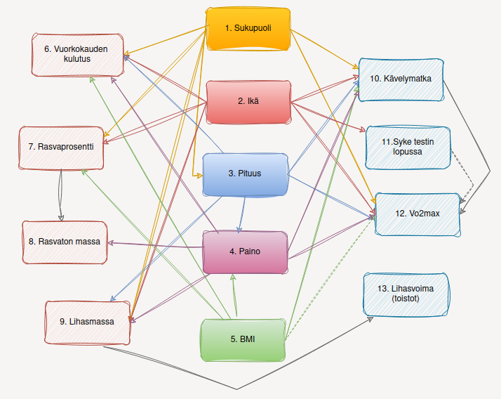

# Asenna tarvittava ympäristö sekä riippuvuudet terminaalissa 

Luo virtuaaliympäristö:  
`python3 -m venv .venv`

Aktivoi ympäristö:
````
# Windows command prompt
.venv\Scripts\activate.bat

# Windows PowerShell
.venv\Scripts\Activate.ps1

# macOS and Linux
source .venv/bin/activate
````

Asenna riippuvuudet:  
`pip install -r requirements.txt`

----
# STREAMLIT

Streamlitin avulla on luotu interaktiivinen ympäristö datan läpikäyntiin sekä kaavojen testaukseen.  
  
Avaa ympäristö localhostissa:  
`streamlit run app.py`

(Tarkoitus saada pyörimään Rahti2:ssa)

-----

# Kansiorakenne ja sisältö

**data**
* generoitu data csv-muodossa

**images**
* kuvat

**app.py**
* streamlit-pohjainen web-sovellus pohjautuu tähän tiedostoon
* datan visualisointi
* interaktiivisuus: rivin valinta, muutostekijöiden valinta
* kaavojen vaikutuksen visualisointi

**datageneraattori.ipynb**
* datan generointi vaihe kerrallaan 
* riippuvuudet perusteltu notebookissa
* jokaisella ajokerralla uusia satunnaislukuja (**EI** `np.random.seed()`- käytössä)

  
*Piirteiden riippuvuudet nuolilla merkittynä.*

**kaavat-testi.ipynb**
* testattu sovitekäyrien kaavojen antamia tuloksia x:n kokonaislukuarvoilla väliltä `0....26` (*sovitekäyrät eivät toimi viikon 26 jälkeen*).  
(x=viikkojen lkm)


**kaavat.py**
* sisältää sovitekäyrien kaavat `.xlsl`-tiedostoista
* Maksimaalisen hapenottokyvyn muutokset
    * `hiit_training`
    * `low_impact_three_per_week`
    * `low_impact_two_per_week`
* Lihasmassan muutokset:
    * `muscle_mass_blue_orig`
    * `muscle_mass_orange_orig`
* Lihasvoiman muutokset
    * `muscle_strength_high_load_orig`
    * `muscle_strength_medium_load_orig`
    * `muscle_strength_low_load_orig`

[Hiit harjoittelun vaikutukset vo2max-arvoon](./images/hiit_vo2max.png)  
[Matalatehoisen harjoittelun vaikutus vo2max-arvoon](./images/matalatehoinen_vo2max.png)  
[Lihasmassan muutokset eri harjoittelumuodoilla](./images/lihasmassan_muutokset.png)  
[Maksimivoiman kehittyminen eri harjoitusmuodoilla](./images/maksimivoiman_muutokset.png)

**kehonkoostumus_codes.py**
* kaavat kehonkoostumuksen muutosten laskuun 
    * `uusi_vrk_pav`
        * 4 viikon välien lasketaan muuttuneen painon myötä uusi vuorokauden aineenvaihdunta
    * `bmi_laskenta`
        * muuttuneen painon myötä uusi painoindeksin laskeminen
    * `kehonkoostumus`
        * kerätään listaan muuttujien tiedot viikoilta `0-26`
        * lihasvoimaharjoittelun vaikutus painoon ja rasvattomaan massaan
        * energiatasapainon vaikutus rasvamassan määrän ja rasvamassan vaikutus kokonaispainoon ja rasvaprosenttiin (*9kcal = 1g rasvaa*)
        * muuttuneen painon myötä uuden painoindeksin lasku
        * joka neljäs viikko `uusi_vrk_pav`


